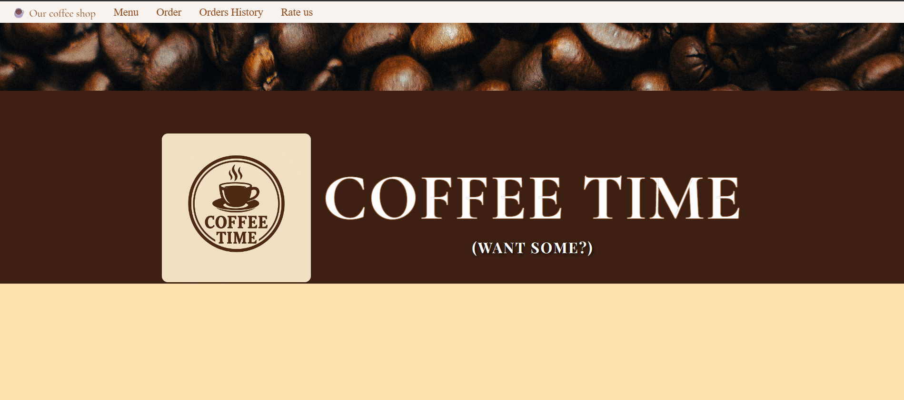
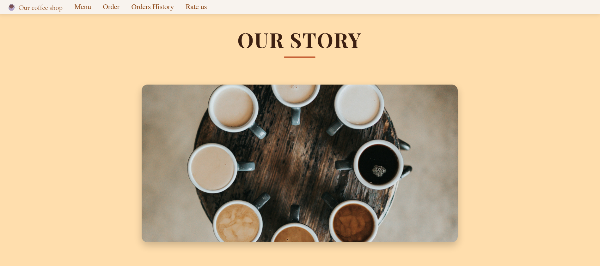
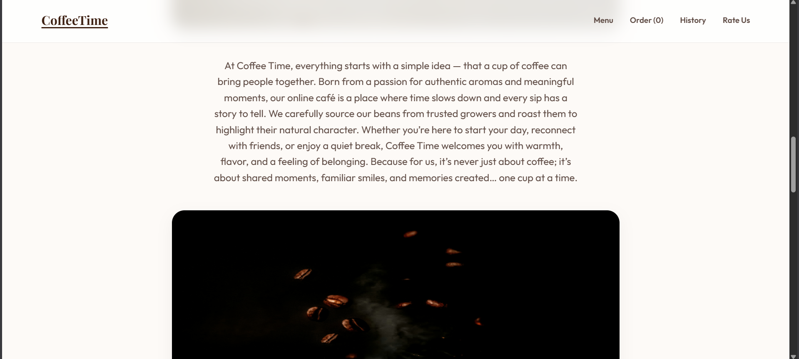
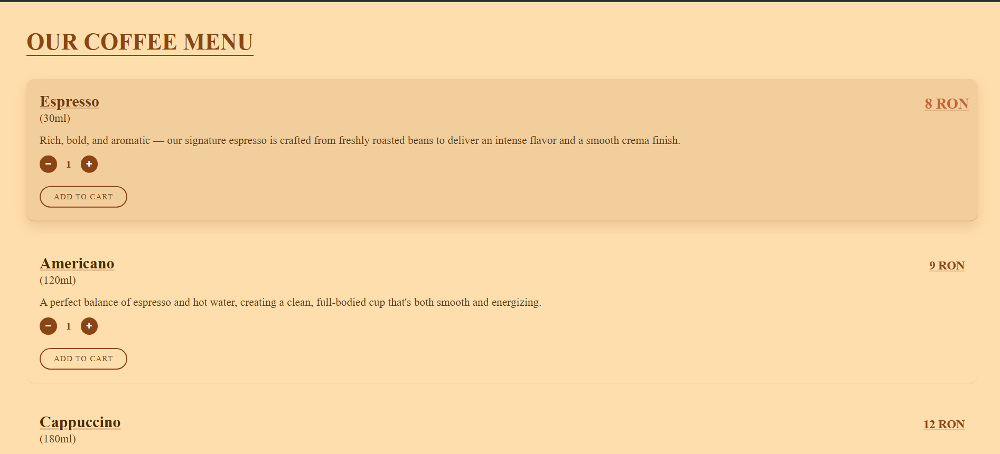
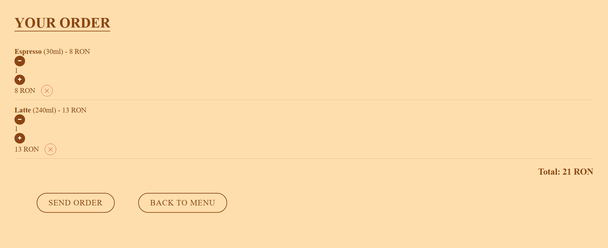
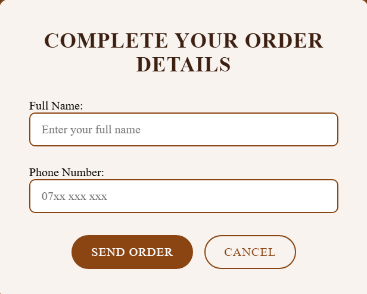
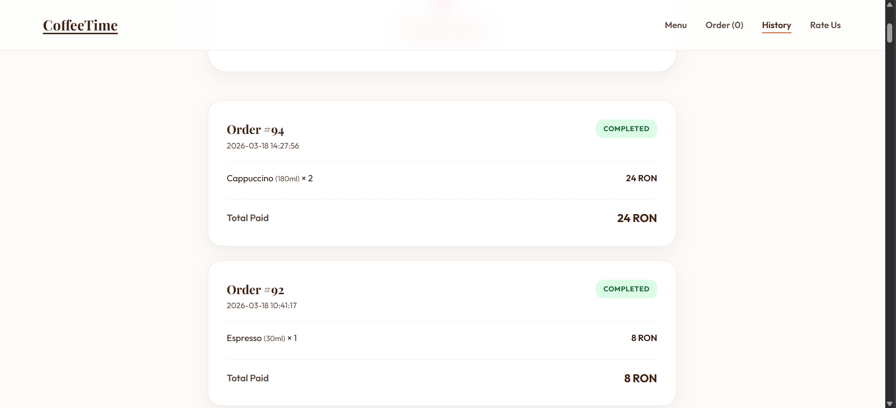
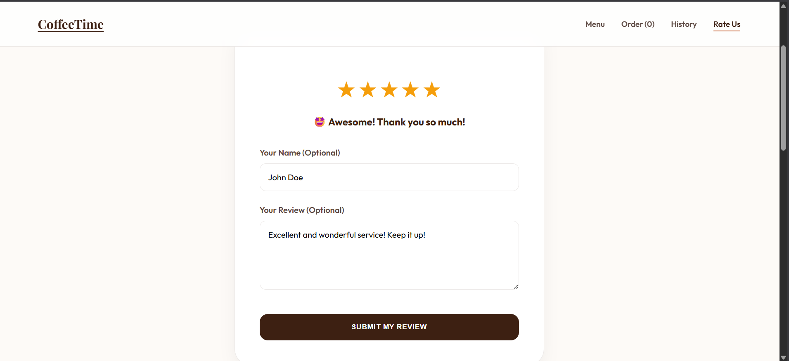

# Coffee Time - Interactive Coffee Shop Website

Coffee Time is a modern, responsive web application designed for a premium coffee shop experience. It features a full ordering system (cart functionality), a review system, and a dynamic history of orders, all built with a clean and professional architecture.

## Key Features

*   Dynamic Product Menu: Interactive menu where users can explore different coffee types with real-time quantity controls.
*   Persistent Shopping Cart: Integrated cart using localStorage and BroadcastChannel to synchronize data across multiple tabs and windows.
*   Order Management: Complete checkout process with a custom modal for user details, sending data to a PHP and MySQL backend.
*   Live Order History: Users can view their past orders, fetched dynamically from the database.
*   Real-time Rating System: A 5-star rating system with hover effects and real-time review updates without page refreshes.
*   Interactive Interface: Custom alerts, intersection observer animations for the "Our Story" section, and smooth micro-interactions.
*   Responsive Design: A sleek, friendly interface with consistent branding across all pages.

## Showcase

## Tech Stack

*   Frontend: HTML5, CSS3, and Vanilla JavaScript (ES6+).
*   Backend: PHP for database interactions and API endpoints.
*   Database: MySQL storing orders and customer reviews.
*   APIs: Custom JSON-based PHP endpoints.

## Development Highlights

*   Vanilla JS Implementation: No external libraries or frameworks used for the frontend logic, ensuring high performance and deep control over DOM manipulation.
*   Clean Architecture: Systematic separation of styling, logic, and presentation layers.
*   Data Persistence: Use of sessionStorage and localStorage for user state management.
*   Security: Server-side password protection for administrative data access.
*   Modern JS Patterns: Use of async/await, fetch API, and real-time communication channels.

## Requirements

*   PHP 7.4 or higher
*   MySQL 5.7 or higher
*   Local server environment (e.g., XAMPP, WAMP, or MAMP)

## How to Run

1.  Clone the repository into your local server directory.
2.  Import the provided database schema (if available) into your MySQL instance.
3.  Ensure your Apache and MySQL servers are running.
4.  Access the site via your local server URL (e.g., http://localhost/Coffee_Shop_Website/).

---
Created by SebiSomu
